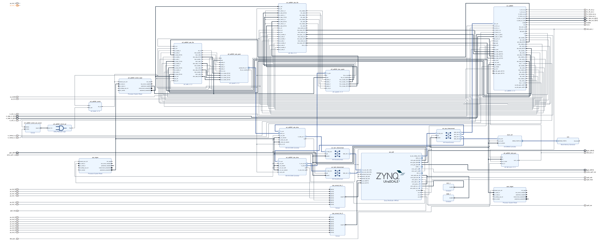

# hdl-rwt

For issues with this repository, its documentation, or additional questions, please reach out to our lead FPGA engineer, Jonathan Ambrose, at (jambrose@redwiretechnologies.us).

---

# Getting Started

* For building
	* Make sure you have all the [requirements](#requirements) installed on your machine
	* Follow the usage of the [build projects script](#build-script)
* For information on what each personality does and what is included in them, you may find descriptions in the [personalities section](#personalities)

--- 

# Requirements

* Linux OS
* Vivado 2021.2
* git
* make
* Analog Devices [hdl](https://github.com/analogdevicesinc/hdl/tree/2021_R2) (Please note that this is the specific commit that builds have been tested against) checked out into the same folder as `hdl-rwt`
* Python 3.x
* Python Libraries
    * Subprocess
    * Multiprocessing
    * os
    * copy
    * argparse
    * pkgutil

--- 

# Optional Requirements for Additional Functionality

* To create graphs of utilization and Markdown to organize them
    * Python Libraries
        * csv
        * imgkit
        * pandas
        * matplotlib
        * prettytable
    * wkhtmltopdf
* To view utilization similar to Vivado's utilization viewer but without requiring launching Vivado
    * Python Libraries
        * gi
        * sys
* For generating DTS for created projects
    * [device-tree-xlnx](https://github.com/Xilinx/device-tree-xlnx/tree/xilinx_v2021.2) (Please note that this is the specific required commit for this version of Vivado)

--- 

# Utilization

The `utilization` directory stores information regarding the most recent set of builds using the projects in this repository. 
There are a set of Markdown files (starting with [utilization.md](utilization/utilization.md)) that organizes the information in an easy-to-navigate format. 
Additionally, full utilization reports can be viewed in the directory `utilization/utilization`. 

--- 

# Personalities

For clarification's sake on the nomenclature, a "personality" is a generic block diagram configuration that can/will be customized on a per board basis. A "project" is the single customized Vivado project for a combination of personality and board. 

## `blank`

The `blank` personality is the most barebones personality as a part of the BSP. It simply sets up the processor in the same configuration as the other personalities that are a part of this BSP.   

The current utilization numbers for this personality can be found [here](utilization/markdown/personalities/blank.md).

### Block Diagram

<center>


[](images/bd/blank.jpg)


</center>

### GPIO Description Table  

<center>

| Pin Number | Name                          | In/Out |
| ---------- | ----------------------------- | ------ |
| 0-11       | GPIO Header                   | IO     |
| 12-15      | Reserved                      |        |
| 16-21      | Personality Card GPIO         | IO     |
| 22         | Pushbutton Interrupt          | In     |
| 23         | Pushbutton Reset Power        | In     |
| 24         | Watchdog                      | Out    |
| 25         | USBC_ID                       | In     |
| 26-31      | Reserved                      |        |
| 32-39      | AD9361 CTRL_OUT (gpio_status) | In     |
| 40-43      | AD9361 CTRL_IN (gpio_ctl)     | Out    |
| 44         | AD9361 EN AGC                 | Out    |
| 45         | AD9361 Sync                   | Out    |
| 46         | AD9361 Resetb                 | Out    |
| 47-94      | Reserved                      |        | 

</center>


## `gr-iio`

The `gr-iio` personality is the equivalent of the FMCOMMS2 project provided by Analog Devices.

The current utilization numbers for this personality can be found [here](utilization/markdown/personalities/gr-iio.md).

### Block Diagram

<center>

[](images/bd/gr-iio.jpg)

</center>

### GPIO Description Table  

<center>

| Pin Number | Name                          | In/Out |
| ---------- | ----------------------------- | ------ |
| 0-11       | GPIO Header                   | IO     |
| 12-15      | Reserved                      |        |
| 16-21      | Personality Card GPIO         | IO     |
| 22         | Pushbutton Interrupt          | In     |
| 23         | Pushbutton Reset Power        | In     |
| 24         | Watchdog                      | Out    |
| 25         | USBC_ID                       | In     |
| 26-31      | Reserved                      |        |
| 32-39      | AD9361 CTRL_OUT (gpio_status) | In     |
| 40-43      | AD9361 CTRL_IN (gpio_ctl)     | Out    |
| 44         | AD9361 EN AGC                 | Out    |
| 45         | AD9361 Sync                   | Out    |
| 46         | AD9361 Resetb                 | Out    |
| 47         | UP Enable                     | Out    |
| 48         | UP TXnRX                      | Out    |
| 49-94      | Reserved                      |        | 

</center>

## `default`

The `default` personality is similar to `gr-iio`, but there are some notable differences. It includes CIC filtering for downsampling, as well as support for inserting tags into the stream of data.

The current utilization numbers for this personality can be found [here](utilization/markdown/personalities/default.md).

### Block Diagram

<center>

[](images/bd/default.jpg)

</center>

### GPIO Description Table  

<center>

| Pin Number | Name                          | In/Out |
| ---------- | ----------------------------- | ------ |
| 0-11       | GPIO Header                   | IO     |
| 12-15      | Reserved                      |        |
| 16-21      | Personality Card GPIO         | IO     |
| 22         | Pushbutton Interrupt          | In     |
| 23         | Pushbutton Reset Power        | In     |
| 24         | Watchdog                      | Out    |
| 25         | USBC_ID                       | In     |
| 26-31      | Reserved                      |        |
| 32-39      | AD9361 CTRL_OUT (gpio_status) | In     |
| 40-43      | AD9361 CTRL_IN (gpio_ctl)     | Out    |
| 44         | AD9361 EN AGC                 | Out    |
| 45         | AD9361 Sync                   | Out    |
| 46         | AD9361 Resetb                 | Out    |
| 47         | UP Enable                     | Out    |
| 48         | UP TXnRX                      | Out    |
| 49-94      | Reserved                      |        | 

</center>

--- 

# Library Components

## `concat_9361`

This block concatenates the signals from the `axi_ad9361` block to make them easier to feed into a block.
It also splices apart the signals that go from the DMA back into the FPGA (for transmission), making these easier to pass back through the processing chain. 

## `cic_filter`

This block is a wrapper around the `axi_adc_decimate` block provided by Analog Devices.
It makes a slight modification to the way registers are provided to the block to make it easier to integrate into our build environment.
It also includes a bypass signal if a user would prefer to bypass it.

## `data_order`

This block is made to be inserted on the datapath in the FPGA to test for data validity.
It is controlled by two GPIO lines that allow the user to send either a constant value or the value of a counter (offset per channel).
This should allow a user to analyze data integrity.

## `line_matrix`

This block allows an arbitrary number of inputs to be mapped to an arbitrary number of outputs.

## `default_block`

This is the primary part of our BSP.
This block takes in data from the `concat_9361` block (as well as external signals) and passes it through an internal processing chain.
For received data, the data is passed through a `cic_filter` block, buffered in a FIFO, and muxed out along with tags to represent conditions met within the radio (pps, FIFO overflow event, etc.)
For transmitted data, the data is currently buffered in a FIFO and passed out with no other processing.   

In premise, a user should simply be able to integrate all of their processing logic into `default_block_user.v` (or a copy thereof) to handle whatever processing they need. 

--- 

# Scripts

## `builds`

This directory stores information about supported builds, and it is used in order to indicate the builds that may be performed by `build_projects.py`.

## `lib`

This directory stores library functions used by other scripts

## <a name="build-script">`build_projects.py`</a>

This is the core script of this repository, and it is meant to be called from the root directory of the repository.
This script provides an interface to select what builds you want performed at a given time in an easy to use fashion. 
It also is capable of building all of your requests in parallel with you specifying the number of simultaneous builds to perform.
You can choose to call the equivalent of `make clean` on your selections or build only the project without trying to go through synthesis (or any of the latter steps).
Lastly, you can also create a Git log to let you know the current state of the repository (and any OOT repositories) at build time.
If there are modifications to any of the repositories, the user will be asked to put in a commit message to merely document the changes that were made for this build. 
The log is then inserted into each generated `*.xsa` file (which is nothing more than a glorified `*.zip` with a particular set of files). 
In this way, the user can more easily keep track of the state of repositories at build time, even when these `*.xsa` are moved elsewhere (potentially to the locations of your Yocto/OpenEmbedded builds.   


**USAGE**:    
```
usage: build_projects.py [-h] [-c] [-r] [-p] [-b] [-s] [-o] [--clean] [--clean_lib] [-d] [-n NUM_BUILDS] [-g]

optional arguments:
  -h, --help            show this help message and exit
  -c, --carriers        Automatically select all carriers
  -r, --revisions       Automatically select all revisions
  -p, --personalities   Automatically select all personalities
  -b, --boards          Automatically select all boards
  -s, --som_revisions   Automatically select all som_revisions
  -o, --only_projects   Only create projects
  --clean               Clean instead of creating projects
  --clean_lib           Clean libraries instead of creating projects 
  -d, --dry_run         Don't actually run any commands. Just print them
  -n NUM_BUILDS, --num_builds NUM_BUILDS
                        Number of simultaneous make commands to run.
  -g, --git_log         Create a log of the git repos to put into each xsa file
  --depends             Show dependencies for each project based on the M_REPOS variable 

```

Below is an example interaction. We use the `-d` option to not actually perform the builds but print the commands instead     

**EXAMPLE**

* First we select which personalities we would like to build. If there were an additional carrier board or another revision of `oxygen`, you would first be prompted with carrier board and revision selections. In this case, we choose to build the `blank` and `default` personalities. 

```
$ ./scripts/build_projects.py -d


Select Personality(s) for Revision rev3 of Carrier oxygen
  0: blank
  1: default
  2: gr-iio
  3: All

Selection(s): 0 1
```

* Next we will choose SOMs and SOM revisions to build against for each personality. We select `2cg-1.0` and all revisions of the `4cg` for the `blank` personality

```
Select Board(s) for Personality blank on Revision rev3 of Carrier oxygen
  0: 2cg
  1: 2eg
  2: 3cg
  3: 3eg
  4: 4cg
  5: 4ev
  6: All

Selection(s): 0 4

Select SOM Revision(s) for Board 2cg for Personality blank on Revision rev3 of Carrier oxygen
  0: 1.0
  1: 2.0
  2: All

Selection(s): 1

Select SOM Revision(s) for Board 4cg for Personality blank on Revision rev3 of Carrier oxygen
  0: 1.0
  1: 2.0
  2: 3.0
  3: All

Selection(s): 3
```

* Next we do the same for the `default` personality. For this, we select `2cg-2.0`

```
Select Board(s) for Personality default on Revision rev3 of Carrier oxygen
  0: 2cg
  1: 2eg
  2: 3cg
  3: 3eg
  4: 4cg
  5: 4ev
  6: All

Selection(s): 1

Select SOM Revision(s) for Board 2eg for Personality default on Revision rev3 of Carrier oxygen
  0: 1.0
  1: 2.0
  2: All

Selection(s): 1
```

* We can then see that all the builds would be performed correctly. We first build the libraries and then we build each project. 

```
cd /home/user/repos/hardware/public/hdl-rwt/scripts/../projects/blank/oxygen/rev3
Moved to directory blank/oxygen/rev3
Making library
make -j 1 lib | sed 's/^/  /'
cd /home/user/repos/hardware/public/hdl-rwt/scripts/../projects/default/oxygen/rev3
Moved to directory default/oxygen/rev3
Making library
make -j 1 lib | sed 's/^/  /'
cd /home/user/repos/hardware/public/hdl-rwt/scripts/../projects/blank/oxygen/rev3
Moved to directory blank/oxygen/rev3
Making board 2cg-2.0
make 2cg-2.0 | sed 's/^/  /'
cd /home/user/repos/hardware/public/hdl-rwt/scripts/../projects/blank/oxygen/rev3
Moved to directory blank/oxygen/rev3
Making board 4cg-1.0
make 4cg-1.0 | sed 's/^/  /'
cd /home/user/repos/hardware/public/hdl-rwt/scripts/../projects/blank/oxygen/rev3
Moved to directory blank/oxygen/rev3
Making board 4cg-2.0
make 4cg-2.0 | sed 's/^/  /'
cd /home/user/repos/hardware/public/hdl-rwt/scripts/../projects/blank/oxygen/rev3
Moved to directory blank/oxygen/rev3
Making board 4cg-3.0
make 4cg-3.0 | sed 's/^/  /'
cd /home/user/repos/hardware/public/hdl-rwt/scripts/../projects/default/oxygen/rev3
Moved to directory default/oxygen/rev3
Making board 2eg-2.0
make 2eg-2.0 | sed 's/^/  /'
```

## `create_download_bin.sh`

This script creates a `download.bin` that can be used to replace an existing FPGA load on the Oxygen SDR (File location: `/lib/firmware/rwt/[PROJECT NAME]/[SOM NAME]/download.bin`) given an XSA file. 
The resulting file `download.bin` will be put in the root of the directory this script is called from.


**USAGE**:    
```
usage: create_download_bin.sh <path to xsa> 
```

## `create_dts.sh` and `create_dts.tcl`

A useful helper function for generating the DTS from a given XSA file.
It produces the DTS and puts it in a zip file. 
This requires the `device-tree-xlnx` repository (linked in [Optional Requirements](#optional-requirements-for-additional-functionality) above) to be checked out into the root of `hdl-rwt`.
The script is meant to be called from the root of `hdl-rwt`.    


**USAGE**:    
```
Usage: create_dts.sh [path to xsa] [name of zipped dts]
```

## `create_fsbl.sh` and `create_fsbl.tcl`

A useful helper function for generating the FSBL from a given XSA file.
It produces the FSBL and puts it in a zip file. 
It is meant to be called from the root of `hdl-rwt`.    


**USAGE**:    
```
Usage: create_fsbl.sh [path to xsa] [name of zipped fsbl]
```

## `create_pmufw.sh` and `create_pmufw.tcl`

A useful helper function for generating the PMU Firmware from a given XSA file.
It produces the PMU Firmware and puts it in a zip file. 
It is meant to be called from the root of `hdl-rwt`.    


**USAGE**:    
```
Usage: create_pmufw.sh [path to xsa] [name of zipped pmufw]
```

## `export_builds.py`

This script is used to find and export all of the builds throughout the build system and put them into one place.
It supports filtering, renaming, and calling `create_download_bin.sh` on each one prior to exporting them.

**USAGE**:
```
usage: export_builds.py [-h] [-p PATH] [-s SUBDIR] [-f] [-d] [-n NAME] [-l FILTER] 
                        [-x EXCLUDE] [-v] [-c] [-t STYLE]

Export all Vivado builds to given directory

optional arguments:
  -h, --help            show this help message and exit
  -p PATH, --path PATH  Export path for all of the images
  -s SUBDIR, --subdir SUBDIR
                        Subdirectory of projects to look in such that a subsection may be updated
  -f, --force_rename    Force rename of files to a different name
  -d, --dry_run         Don't actually perform the copy
  -n NAME, --name NAME  Force rename of files to a different name
  -l FILTER, --filter FILTER
                        A string (or comma-separated list of strings) that must be contained in the filepath to the image
  -x EXCLUDE, --exclude EXCLUDE
                        A string (or comma-separated list of strings) that must not be contained in the filepath to the image 
  -v, --verbose         Print the exported files
  -c, --convert         Convert to download.bin
  -t STYLE, --style STYLE
                        A directory sorting order. The default value is crpbs representing the file 
                        hierarchy [carrier board]/[carrier board revision]
                        /[personality]/[SOM]/[SOM revision].
                        Reordering the characters in the string will reorder the 
                        hierarchy accordingly.
```

## `check_builds.py`

This script is designed to look through all of the completed builds and show which ones passed and failed.

## `move_builds.py`

This script is similar to `export_builds.py`, but instead of copying them all to a single directory, it is made to copy the files into the build directory for our Yocto/OpenEmbedded builds for the operating system. 

**USAGE**:    
```
usage: move_builds.py [-h] [-p PATH] [-i IMAGEDIR] [-d] [-l FILTER] [-x EXCLUDE] [-v] [-n]
                      [-s PERSONALITY] [-b BOOT] [-c CARRIER]

Export all Vivado builds to given directory

optional arguments:
  -h, --help            show this help message and exit
  -p PATH, --path PATH  Path to the proper meta directory
  -i IMAGEDIR, --imagedir IMAGEDIR
                        Directory of XSA
  -d, --dry_run         Don't actually perform the copy
  -l FILTER, --filter FILTER
                        A string (or comma-separated list of strings) that must be contained in the filepath to the image
  -x EXCLUDE, --exclude EXCLUDE
                        A string (or comma-separated list of strings) that must not be contained in the filepath to the image
  -v, --verbose         Print the exported files
  -n, --newest          Use newest SOM rev
  -s PERSONALITY, --personality PERSONALITY
                        Personality to use for boot
  -b BOOT, --boot BOOT  Board to use for main.xsa
  -c CARRIER, --carrier CARRIER
                        Carrier directory in meta build tree
```

## `export_utilization.py`

This script is similar to `export_builds.py`, but it does its operations on the utilization reports instead.
It will also parse them to create utilization graphs and tables, as well as generate Markdown to more easily browse and compare the utilization of different projects.
This does require some of the [optional requirements](#optional-requirements-for-additional-functionality).
The `utilization` directory in this repository was made using this script.


**USAGE**:    
```
usage: export_utilization.py [-h] [-p PATH] [-s SUBDIR] [-d] [-l FILTER] [-x EXCLUDE] [-v]

Export utilization to given directory

optional arguments:
  -h, --help            show this help message and exit
  -p PATH, --path PATH  Export path for all of the utilization files
  -s SUBDIR, --subdir SUBDIR
                        Subdirectory of projects to look in such that a subsection may be
                        updated
  -d, --dry_run         Don't actually perform the copy
  -l FILTER, --filter FILTER
                        A string (or comma-separated list of strings) that must be contained in the filepath to the image
  -x EXCLUDE, --exclude EXCLUDE
                        A string (or comma-separated list of strings) that must not be contained in the filepath to the image
  -v, --verbose         Print the exported files
```

## `create_git_log.sh`

This script is designed to traverse `hdl-rwt`, `hdl` from Analog Devices, and any repositories in `oot` to call `git status` and get information about the most recent commit.
If there are currently modifications to the repository, these will be flagged and the user will be asked to input a commit message.
The generated file (`git_log.txt`) will be used to provide the information that will be stored on the ROM in the FPGA project to allow a user to check what the build state was
for a particular image loaded on the target device.

## `git_log_pers.sh`

This script is used by our Makefiles to generate the specific information that should be loaded into the ROM in the FPGA project.
It will generate the appropriate `*.coe` file to intialize the ROM.
In general, this script is only called by the Makefile and is rarely manually used.

**USAGE**:    
```
Usage: git_log_pers.sh [file to write] [project name] [repo list]
```

## <a name="link-script">`link_oot.sh`</a>

This script is supposed to be called from the root of `hdl-rwt` and is meant to be used for linking out-of-tree repositories into the rest of the build system. 
It creates a hard-link from the file in the out-of-tree repository to its corresponding place in the build system. 
This allows us to separate extensions of this BSP into other repositories without having to fork this repository to add in these extensions.

## <a name="unlink-script">`unlink_oot.sh`</a>

The partner script to `link_oot.sh`, this script recursively searches the `oot` directory and then checks and removes every file from the build system that is an exact equivalent. 
It will also remove all empty directories afterwards so that there are no remnants of the parts in the `oot` directory that remain in the build system. 
This script is also meant to be called from the root of `hdl-rwt`.

--- 

# Utils

The utilities in this directory are relatively minor.
They are mostly used for the purpose of parsing and viewing Vivado utilization reports in a meaningful way.    


`vivado_rpt_parser.py` is used as a library that will split apart the lines of one of the utilization reports and make the data from the file easier to access.     


`gui.py` is a visualizer (similar to Vivado's builtin visualizer) to view one of the utilization reports without opening Vivado or the project. 
This does require some of the [optional requirements](#optional-requirements-for-additional-functionality).

--- 

# File Hierarchy

In an effort to avoid copying and pasting code, a system of inherited files was composed so that adding new library components, personalities, or carrier boards would be easier. 
That system will be **briefly** explained here. 
If a user has more specific questions, they may use the contact information above.   

## For Personalities

Below is the way that the file hierarchy works for personalities. 

### Makefiles

There are 7 Makefiles used to build a given project (we will use the `default` personality and `oxygen/rev3` as our combination of carrier board and revision):

* `projects/default/oxygen/rev3/Makefile`
	* This is the Makefile that will "inherit" the others. It defines any libraries needed for its specific build, gives the project a name, and includes the Makefiles specific to the carrier board/revision combination and the Makefile specific to the personality.
* `projects/default/scripts/default.mk`
	* This Makefile adds any files that need to be included as a part of building the personality as a dependency. It also adds any necessary libraries as dependencies and then includes `common_deps.mk`, `axi_ad9361.mk`, and `project.mk`
* `projects/common/oxygen/rev3/scripts/oxygen.mk`
	* This files adds any carrier board specific files as dependencies, defines which SOM format is supported, and includes the Makefile for that SOM format
* `projects/common/scripts/te0820/boards.mk`
	* This defines each SOM that fits within a given form factor that could be used to build and adds all constraints for these specific SOMs as dependencies.
* `projects/common/scripts/common_deps.mk`
	* This file simply adds some common dependencies to the list of dependencies so they all don't have to be typed every time
* `projects/common/scripts/axi_ad9361.mk`
	* This file adds all the necessary components to use the `axi_ad9361` IP block in a user's design as dependencies. 
* `projects/common/scripts/project.mk`
	* This Makefile uses all of the dependencies, libraries, and variables defined in the other Makefiles to actually define the buildable targets

### TCL Scripts

There are quite a few TCL scripts used to build a given project (we will use the `default` personality and `oxygen/rev3` as our combination of carrier board and revision):

* `projects/default/oxygen/rev3/system_project.tcl`
	* This script simply sets its current directory to a variable name and calls `common_project.tcl`
* `projects/common/scripts/common_project.tcl`
	* This script sources all of the other files on this list and starts the process of actually building the project
* `projects/common/scripts/common_functions.tcl`
	* This simply describes some common TCL functions that we may use for certain builds
* `projects/common/oxygen/rev3/scripts/supported_boards.tcl`
	* This sets the supported SOM format type for the carrier board
* `projects/common/scripts/te0820/boards.tcl`
	* This looks at the arguments passed to set the FPGA device and board part
* `projects/common/scripts/common_project_files.tcl`
	* This adds some of the project files to the appropriate variable
* `projects/common/scripts/common_bd.tcl`
    * This sources `*.tcl` files that are meant to be run for every project
* `projects/common/scripts/create_rom.tcl`
    * This creates a ROM on the AXI bus that contains information about the state of all repositories used to build the given project.
* `projects/common/scripts/te0820/common_constraints.tcl`
	* This adds the necessary constraints file to the project files in the appropriate variable
* `projects/common/oxygen/rev3/scripts/project_files.tcl`
	* This will add certain files to every project that uses the board (some conditionally based on set variables). In this case, we see that constraints relevant to the AD9361 component are added based on whether the `axi_ad9361` block is in the project.
* Vivado Directives (things like Synthesis and Implementation strategies) are then sourced in the following order
	* `projects/common/oxygen/rev3/vivado_directives.tcl`
		* Vivado directives for all builds for `oxygen/rev3`
	* `projects/default/scripts/vivado_directives.tcl`
		* Vivado directives for all builds of the `default` project`
	* `projects/default/oxygen/rev3/vivado_directives.tcl`
		* Vivado directives specific to `default/oxygen/rev3`

## For Library Components

Library components are much simpler. 
A component's Makefile defines its name and dependencies before sourcing a common Makefile used by all of the library components.
The common Makefile simply sets up the environment and defines the targets.   


As for the TCL scripts, each component has its own TCL script since the building of these IP blocks can vary so wildly. 

--- 

# OOT Modules

One of the primary purposes of the build system created here is to support a user being able to add their own components without having to fork the repository.
This provides ease of use, as it allows the user to receive any updates for this repository without having to recreate a fork or deal with painful merges. 
A **brief** explanation of creating OOT modules will be outlined here. 
If a user has more specific questions or if something is unclear, they may use the contact information above. 

## Writing OOT Modules

The premise of the OOT modules is relatively simple.
A user will create their own repository that will be checked out in the `oot` directory of this repository.
Their repository will be structured in the same way as this repository (i.e. personalities will be in `<repo root>/projects/<personality name>`, library components will be in `<repo root>/library/<component name>`, etc.)
This allows linking the modules directly into the build structure. 
The [linking](#link-script)/[unlinking](#unlink-script) methodology is described with the scripts that perform it. 

### <a name="oot-library">Library Components</a>

Library components are perhaps the simplest parts to add to the build system.
We will look at the `concat_9361` component as an example.
Let's look at the directory structure.

```
$ ls -R concat_9361/
concat_9361/:
concat_9361_constr.xdc  concat_9361_ip.tcl  Makefile  src/

concat_9361/src:
concat_9361.v
```

A component generically must contain:
* A constraints file (in this case `concat_9361_constr.xdc`)
	* This file contains any specific constraints that must be applied for the component. This component has none, so the file is empty
* A Makefile
	* This is discussed [above](#makefiles), but it essentially marks your sources as dependencies, sets the component name, and calls a master Makefile for library components. Here is the example for this component
	```
	LIB_NAME = concat_9361

	M_DEPS = \
	  src/concat_9361.v \
	  concat_9361_constr.xdc \
	  concat_9361_ip.tcl

	include ../scripts/library.mk
	```
* A TCL script for generating your component (in this case `concat_9361_ip.tcl`)
	* This will set up some generic environment stuff and then create the component as an IP block. It is recommended to copy this from an existing component and change the relevant parts. Here is the example for this component
	```
	# ip

	if {$argc < 1} {
		puts "Project directory must be specified"
		exit 1
	}

	set AD_LIB_DIR [lindex $argv 0]
	set script_dir [ file dirname [ file normalize [ info script ] ] ]

	source $AD_LIB_DIR/scripts/adi_env.tcl
	source $ad_hdl_dir/library/scripts/adi_ip_xilinx.tcl

	adi_ip_create concat_9361
	adi_ip_files concat_9361 [list \
	  "$script_dir/src/concat_9361.v" \
	  "$script_dir/concat_9361_constr.xdc" ]

	adi_ip_properties_lite concat_9361

	set_property vendor redwiretechnologies.us [ipx::current_core]
	set_property library user [ipx::current_core]
	set_property taxonomy /RWT [ipx::current_core]
	set_property vendor_display_name {RWT} [ipx::current_core]
	set_property company_url {http://www.redwiretechnologies.us} [ipx::current_core]

	ipx::remove_all_bus_interface [ipx::current_core]
	ipx::save_core [ipx::current_core]
	```

A component may optionally contain:
* The source code (all files in the `src` directory)
	* Your component will likely contain some source code to use as a part of your generated component
* Simulation sources (contained in a `sim` directory)
	* These sources can be included in the `sim_files` inside your TCL script and can be used for validating your code. An example of this can be seen in the `default_block` component.
* IP sources (contained in a `IP` directory)
	* These will contain a folder named `<ip_name>` which will contain the file `<ip_name>.xci`

### <a name="oot-boards">Boards</a>

Boards are a bit harder to add, and they are less likely to be added by users. There are a few use cases (and I'm sure there are more) in which a user may want to do so, though:

* The user would like to permanently assign some of the GPIOs to be used for a particular application within the FPGA
* The user would like to add an RF personality card and needs some of the signals between the SOM and personality card to be conditioned in the FPGA
* The user designs a custom carrier board but would like to use this build system. 

We will look at the `oxygen/rev3` as an example.
First we will examine the directory structure of how this is added as a supported board (note that boards are **always** defined as `<board_name>/<revision>`):

```
$ ls -R projects/common/oxygen
projects/common/oxygen:
rev3/

projects/common/oxygen/rev3:
oxygen_system_bd.tcl  oxygen_system_constr.xdc  scripts/

projects/common/oxygen/rev3/scripts:
oxygen.mk  project_files.tcl  supported_boards.tcl
```

A board must contain:
* A block diagram script (in this case `oxygen_system_bd.tcl`)
	* This script will generically contain the setup of system clocks, I/O ports that are relevant to all projects that use this board, and the instantiation and configuration of the ZYNQ Processing System. Because we have multiple carrier boards that use the TE0820 SOMs, we have a common file for all of them that gets sourced, resulting in a much smaller file here. Here is the file
	```
	source $script_dir/../../../common/scripts/bd/rwt_te0820_carrier_bd.tcl

	set_property -dict [list \
	  CONFIG.PSU__PCIE__PERIPHERAL__ENABLE {1} \
	  CONFIG.PSU__PCIE__PERIPHERAL__ENDPOINT_IO {MIO 33} \
	  CONFIG.PSU__PCIE__PERIPHERAL__ROOTPORT_IO {MIO 33} \
	  CONFIG.PSU__PCIE__DEVICE_PORT_TYPE {Root Port} \
	  CONFIG.PSU__PCIE__REF_CLK_SEL {Ref Clk3} \
	  CONFIG.PSU__PCIE__CLASS_CODE_SUB {0x04} \
	  CONFIG.PSU__PCIE__CRS_SW_VISIBILITY {1} \
	] [get_bd_cells sys_ps8]

	ad_connect  gpio_i sys_ps8/emio_gpio_i
	```
* A constraints file (in this case `oxygen_system_constr.xdc`)
	* These are constraints that will apply for every project that uses a given board. For Oxygen, we set a watchdog pin and an `emio_uart` interface to the GPS. Here is the file
	```
	set_property -dict {PACKAGE_PIN AD9 IOSTANDARD LVCMOS18} [get_ports emio_uart1_txd*]

	set_property -dict {PACKAGE_PIN AG9 IOSTANDARD LVCMOS18 PULLUP true} [get_ports emio_uart1_rxd*]

	set_property -dict {PACKAGE_PIN M8  IOSTANDARD LVCMOS18} [get_ports wd]
	```
* A supported boards script (in this case `scripts/supported_boards.tcl`)
	* This simply defines a variable that declares which SOM format is supported. Here is the file
	```
	set supported_boards "te0820"
	```	
* A project files script (in this case `scripts/project_files.tcl`)
	* This will add certain files to every project that uses the board (some conditionally based on set variables). In this case, we see that constraints relevant to the AD9361 component are added based on whether the `axi_ad9361` block is in the project. We do this because that IP block is not included as a part of the `blank` project. If a user never desired to build the `blank` project, this would not be necessary. Here is the file
	```
	lappend project_files \
	  "$script_dir/../../../common/oxygen/rev3/oxygen_system_constr.xdc"

	if {[info exists NO_ADI9361] != 0} {
		lappend project_files \
		  "$script_dir/../../../common/shared/$supported_boards/fake_ad9361_constr.xdc"
	} else {
		lappend project_files \
		  "$script_dir/../../../common/shared/$supported_boards/ad9361_constr.xdc"
	}
	```
* A makefile (in this case `scripts/oxygen.mk`)
	* This Makefile is pretty straightforward (and it is previously described [here](#makefiles)). It adds a couple of dependencies, sets what SOM format is supported, and includes the relevant Makefile for the given supported SOM format. Here is the file
	```
	SUPPORTED_BOARDS := te0820
	M_DEPS += ../../../common/oxygen/rev3/oxygen_system_constr.xdc
	M_DEPS += ../../../common/oxygen/rev3/oxygen_system_bd.tcl

	include ../../../common/scripts/$(SUPPORTED_BOARDS)/boards.mk
	```

The board may also optionally contain:
* A Vivado directives file (in this case it would be in `projects/common/oxygen/rev3/vivado_directives.tcl`)
	* This file contains Vivado directives that will always be used when building projects using this board

<a name="adding-board-to-personality">Adding your board into an existing personality is much simpler. Let's look at the directory structure for `oxygen/rev3` in the `default` project</a>
```
$ ls -R default/oxygen/rev3
default/oxygen/rev3:
Makefile  system_bd.tcl  system_project.tcl  system_top.v
```

The following files are required:
* A Makefile
	* The Makefile sets the project name and any additional dependencies before sourcing the Makefiles for this personality (`default/scripts/default_proj.mk`) and the one for this board (`common/oxygen/rev3/scripts/oxygen.mk`). Descriptions of these Makefiles can be found [here](#makefiles). Here is the file
	```
	PROJECT_NAME := oxygen_default
	M_CUSTOM_LIBS :=
	M_ADI_LIBS :=
	M_DEPS :=

	include ../../../common/oxygen/rev3/scripts/oxygen.mk
	include ../../scripts/default_proj.mk
	```
* A block diagram script (in this case `system_bd.tcl`)
	* This file is quite simple. It helps to set up the environment before sourcing the scripts relevant to this personality (`default/scripts/default_bd.tcl`), to this board (`common/oxygen/rev3/oxygen_system_bd.tcl`), and to all projects (`common/scripts/common_bd.tcl`) and setting any block parameters that are specific to this combination of personality and board. All of these TCL scripts are described [here](#tcl-scripts). Here is the file
	```
	set script_dir [file dirname [ file dirname [ file normalize [ info script ]/... ] ] ]

	puts $script_dir

    source "$script_dir/../../../common/oxygen/rev3/oxygen_system_bd.tcl"
    source "$script_dir/../../scripts/default_bd.tcl"
    source "$script_dir/../../../common/scripts/common_bd.tcl" 

	ad_ip_parameter axi_ad9361 CONFIG.ADC_INIT_DELAY 11
	```
* A project creation script (in this case `system_project.tcl`)
	* This will set any specific variables that need to be set (and set the `script_dir` variable) before calling `common_project.tcl`. The description of this file (as well `common_project.tcl` can be found [here](#tcl-scripts). Here is the file
	```
	set script_dir [ file dirname [ file normalize [ info script ] ] ]
	source "$script_dir/../../../common/scripts/common_project.tcl"
	```
* A top level wrapper for wrapping your created block diagram (in this case `system_top.v`)
	* This file will generically be the same for every project that uses your board (unless the I/O changes from your block diagram). You'll set up the GPIOs and the connections that will leave the SOM to connect elsewhere. Because of its length, I will not include the file here. 

### <a name="oot-personality">Personalities</a>

Adding a personality is the most likely thing a user will want to do with an OOT module. 
We will look at the `default` personality for this example. 
Let's take a look at the directory structure

```
$ ls -R projects/default
projects/default:                                                                                                                                                                              common/  oxygen/  scripts/                                        
                                                                                                                                                                                               projects/default/common:                                                            
te0820/                                                                                                                                                                                                        
projects/default/common/te0820:                                                                                                                                                                default_constraints.xdc 
                                                                                                                                                                                               projects/default/oxygen:       
rev3/                                                                                                                                                                                                                 
projects/default/oxygen/rev3:                                                                                                                                                                  Makefile  system_bd.tcl  system_project.tcl  system_top.v
                                                                                                                                                                                               projects/default/scripts:
default_bd.tcl  default_proj.mk
```

For a personality, the following files are required
* A constraints file for each SOM format (in this case `default/common/te0820/default_constraints.xdc`)
	* This can be setting generic constraints for the block diagram (such as false paths), or it could be used for setting other constraints specific to a given SOM format for this personality. In this case, it constrains the PPS line (which is a part of the `default` personality). Here is the file
	```
	set_property -dict {PACKAGE_PIN L8  IOSTANDARD LVCMOS18} [get_ports pps]
	```
* A block diagram file (in this case `default_bd.tcl`)
	* This file sets up all of the other IP blocks that are a part of the block diagram for this personality and makes the connections between them. It also sets up any additional I/O that may be required. The file is a bit long, so it is not included here.
* A Makefile (in this case `default_proj.mk`)
	* This is described [here](#makefiles). Here is the file
	```
	M_CUSTOM_LIBS += concat_9361
	M_CUSTOM_LIBS += default_block
	M_CUSTOM_LIBS += cic_filter

	M_DEPS += ../../scripts/default_bd.tcl

	include ../../../common/scripts/common_deps.mk
	include ../../../common/scripts/axi_ad9361.mk
	include ../../../common/scripts/project.mk
	```

For adding a board to your personality, please refer to the instructions [here](#adding-board-to-personality).

### Adding to the build system

The last step to adding any OOT module is linking it into the build system. 
You will only have to do this for boards and personalities.

Let's say you created a custom OOT revision (named "custom") for Oxygen that set some of the GPIOs to some kind of fixed function.
In your OOT module, you would create the file `scripts/builds/oot_b/oxygen_custom.py` with the following contents:
```
from . import oot_builds

oxygen_custom_dict = {  "oxygen"   : {
                                        "revisions" : ["custom"],
                                     }
                     }

oot_builds.merge(oot_builds.supported_oot, oxygen_custom_dict)
```

This will add a revision named `custom` to Oxygen that can be used as a part of the build process. Keep in mind that you must implement the `custom` revision in each personality for the builds to actually work.   


Perhaps instead you created your entirely new board called `helium` that still used the TE0820 SOMs, implemented all of the personalities for it, but only wanted to target a `3eg` SOM.
In your OOT module, you would create the file `scripts/builds/oot_b/helium.py` with the following contents:
```
from .. import te0820_soms
from . import oot_builds

helium_dict = { "helium"     : {
                                        "revisions" : ["rev1"],
                                        "images"    : ["blank", "default", "gr-iio"],
                                        "boards"    : ["3eg"],
                                        "som_rev"   : te0820_soms.te0820_som_revisions,
                               },
              }

oot_builds.merge(oot_builds.supported_oot, helium_dict)

```

This will add a board named `helium` with the revision `rev1`.
It will build for any revision of the `3eg` SOM, and will build for any personality.


Let's imagine that you wanted to build for all of the SOMs instead. 
The file would instead have the following contents:
```
from .. import te0820_soms
from . import oot_builds

helium_dict = { "helium"     : {
                                        "revisions" : ["rev1"],
                                        "images"    : ["blank", "default", "gr-iio"],
                                        "boards"    : te0820_soms.te0820_boards,
                                        "som_rev"   : te0820_soms.te0820_som_revisions,
                               },
              }

oot_builds.merge(oot_builds.supported_oot, helium_dict)

```


Now let's say you want to add your new personality `elephant` to be built for the Oxygen. 
In your OOT module, you would create the file `scripts/builds/oot_b/elephant.py` with the following contents:
```
from . import oot_builds

elephant_dict = {  "oxygen"   : {
                                 "images" : ["elephant"],
                                }
                }

oot_builds.merge(oot_builds.supported_oot, elephant_dict)
```

Now the `elephant` personality can be built for each revision of the Oxygen and for each SOM. 


What if we only wanted to allow the `elephant` personality to be built for the `3eg` SOM with revision `2.0`?
In your OOT module, you would create the file `scripts/builds/oot_b/elephant.py` with the following contents:
```
from . import oot_builds

elephant_dict = {  "oxygen"   : {
                                 "images"  : ["elephant"],
				 "special" : {
					      "elephant": {
							   "boards" : ["3eg"],
							   "som_rev": ["2.0"],
							  },
					     },
                                }
                }

oot_builds.merge(oot_builds.supported_oot, elephant_dict)
```

The `special` directive allows you to special-case specific personalities to have different attributes than the generic ones used for the carrier board. 
This would make it so that the `elephant` personality could be built on the Oxygen for any revision of the carrier board, but only for revision `2.0` of the `3eg` SOM.

## Linking and Building OOT Modules

The steps for linking and building with your OOT Modules is as follows:

1. Link your module. This process is described with the description of the [script](#link-script) that performs the linking. Simply call `scripts/link_oot.sh` from the root directory of this repository
2. Use the build script as described [here](#build-script)
3. Optionally [unlink](#unlink-script) your modules after building is completed.
