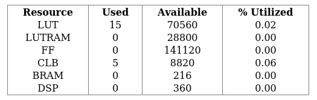
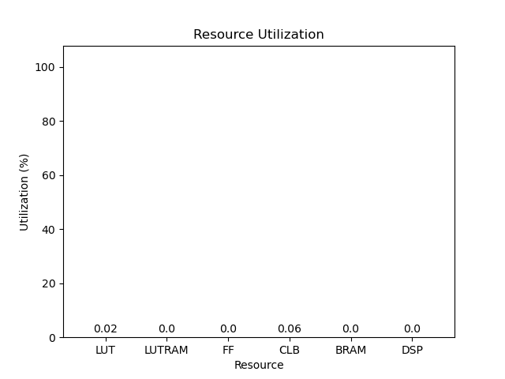
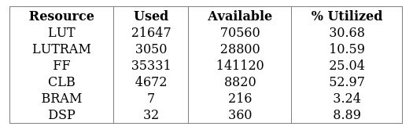
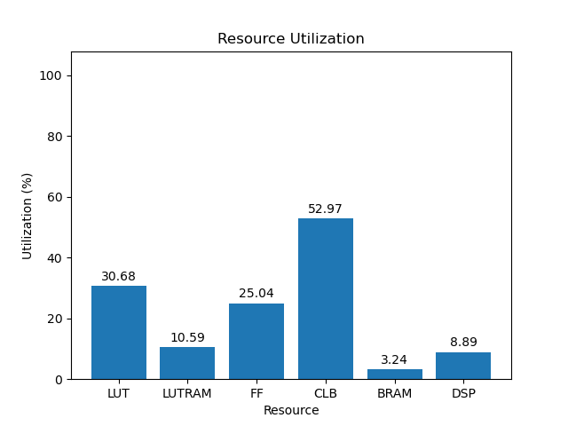

# 3eg

[Back](<../rev3.md>)

---

## 1.0
### blank

	

	

`/usr/bin/python ./scripts/gui.py ./utilization/oxygen/rev3/blank/3eg/1.0/utilization-full.rpt`

### default

	

	

`/usr/bin/python ./scripts/gui.py ./utilization/oxygen/rev3/default/3eg/1.0/utilization-full.rpt`

### gr-iio

	

	

`/usr/bin/python ./scripts/gui.py ./utilization/oxygen/rev3/gr-iio/3eg/1.0/utilization-full.rpt`

## 2.0
### blank

	

	

`/usr/bin/python ./scripts/gui.py ./utilization/oxygen/rev3/blank/3eg/2.0/utilization-full.rpt`

### default

	

	

`/usr/bin/python ./scripts/gui.py ./utilization/oxygen/rev3/default/3eg/2.0/utilization-full.rpt`

### gr-iio

	

	

`/usr/bin/python ./scripts/gui.py ./utilization/oxygen/rev3/gr-iio/3eg/2.0/utilization-full.rpt`

