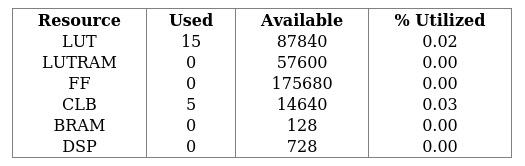
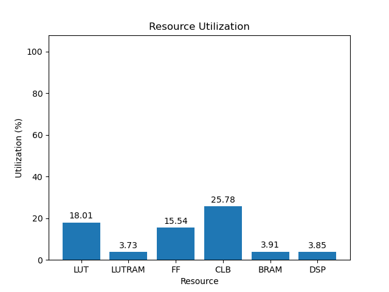

# rev3

[Back](<../oxygen.md>)

---

## blank

	

	

`/usr/bin/python ./scripts/gui.py ./utilization/oxygen/rev3/blank/4cg/2.0/utilization-full.rpt`

## default

	

	

`/usr/bin/python ./scripts/gui.py ./utilization/oxygen/rev3/default/4cg/2.0/utilization-full.rpt`

## gr-iio

	

	

`/usr/bin/python ./scripts/gui.py ./utilization/oxygen/rev3/gr-iio/4cg/2.0/utilization-full.rpt`

